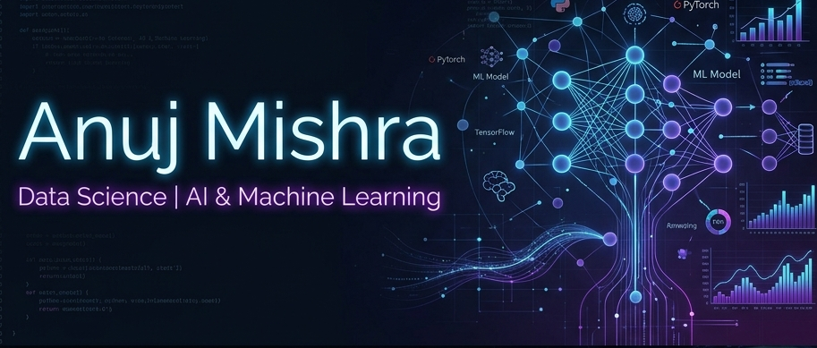

# 
👋 Welcome to My GitHub Profile!

  

<h2 align="center">Anuj Mishra 🚀</h2>

  <strong>Aspiring Software Development Engineer (SDE) | Java Developer</strong>

  
  
  

---

### 💫 About Me

I am a passionate software engineer studying at **Sant Longowal Institute of Engineering and Technology (SLIET)**. I enjoy solving algorithmic puzzles, building robust software applications, and diving deep into object-oriented programming and system design.

- 🎓 **Education**: Sant Longowal Institute of Engineering and Technology (SLIET)
- 📍 **Location**: Kanpur, Uttar Pradesh, India
- ✉️ **Contact**: [anujmishra1823@gmail.com](mailto:anujmishra1823@gmail.com)
- 🧠 **Focus**: Data Structures & Algorithms (DSA), Backend Development, System Design, and Object-Oriented Programming (OOP)

---

### 🛠️ Tech Stack & Skills

- **Languages**: 
  
  
  
  
- **Core Computer Science**: 
  
  
  
- **Tools & Version Control**: 
  
  
  
  

---

### 📊 Coding & Performance Metrics

  
  

  

---

### 🤝 Let's Connect!

I'm always open to discussing new projects, collaborating on open-source, or just chatting about technology and AI!

- 💼 **LinkedIn**: [Anuj Mishra](https://www.linkedin.com/in/anuj-mishra-836a64379/)
- 📧 **Gmail**: [anujmishra1823@gmail.com](mailto:anujmishra1823@gmail.com)
